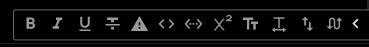

# Discord AMOBlack
Very dark Discord theme, ideal for AMOLED displays.

Most plugins work without any problems. If some plugin element is not made black or there's some other problem, please create an issue [here][issues].

### Currently supported plugins:
1. **[MemberCount by Arashiryuu][plugin membercount]**  
(background color fix)  

2. **[CharCounter by DevilBro][plugin charcounter]**  
(placement and color fix)  

3. **[BetterFormattingRedux][plugin bfredux]**  
(background color fix)  

Every other plugin I use works well, but if you use one that doesn't look good with this theme, feel free to [create an issue][issues]!

How to install
---
1. Download the file called [amoblack.theme.css](amoblack.theme.css) (or [amoblack-dev](amoblack-dev.theme.css) for dev version) by right-clicking the button
`Raw` on its page and selecting `Save link as`. Don't change its name and click `Save`.
2. In Discord with BandagedBD installed, go to `Settings`→`Themes`→`Open Theme Folder`.
3. Drag and drop (or move another way) the file you downloaded into the theme folder that Discord opened.
You can close the file explorer windows.
4. Go back to Discord. In the themes settings, you should now see: `Discord AMOBlack v[???] by TheChilliPL`.
To enable it, toggle the switch on its right. The theme should now be loaded.

<!-- Links -->
[issues]: /../../issues/
[plugin membercount]: https://github.com/Arashiryuu/crap/blob/master/ToastIntegrated/MemberCount/MemberCount.plugin.js
[plugin charcounter]: https://github.com/mwittrien/BetterDiscordAddons/tree/master/Plugins/CharCounter
[plugin bfredux]: https://github.com/rauenzi/BetterDiscordAddons/tree/master/Plugins/BetterFormattingRedux